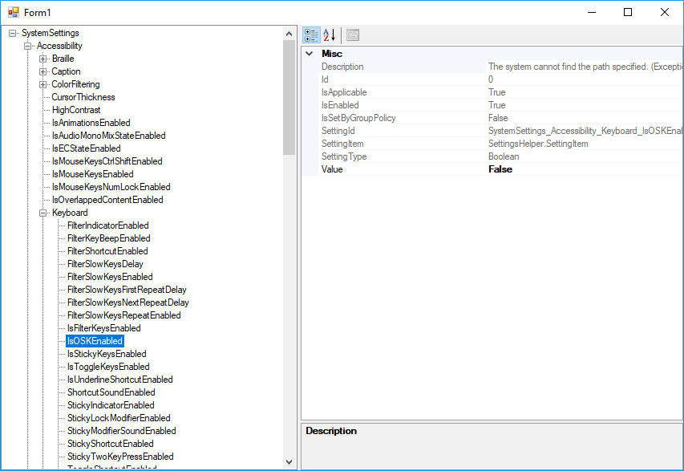

# Windows system settings

Small utility that sets Windows settings via the back-end used by the Windows 10 setting app.

# :warning: :radioactive: :biohazard: :underage: :no_smoking: 

This tool has the potential to make most Windows settings easily configurable. Howewer, the Windows Settings back-end
is undocumented. Under-handed techniques are used, and some settings will crash. Different OS releases may have
different settings.

### The interesting code is in the [SettingsHelper](settingsHelper/SettingsHelper).

## Usage

Reads a JSON array of payloads from stdin:

    SettingsHelper < payload.json

List all possible settings for the current system:

    SettingsHelper -list

## Payload JSON

The payload sent to the application's standard input looks like this:

```json
[
    {
        "settingID": "SystemSettings_Accessibility_Magnifier_IsEnabled",
        "method": "SetValue",
        "parameters": [ true ]
    }
]
```

* `settingID`: The setting ID. See `SettingsHelper -list`
* `method`: The method of  to invoke.
* `parameters`: Parameters to pass (optional).

There can be several items, allowing more than one setting to be applied.

### Example: Turn "night mode" on:

```json
[
    {
        "settingID": "SystemSettings_Display_BlueLight_ManualToggleQuickAction",
        "method": "GetValue"
    }
]
```

See [Further documentation](settingsHelper/README.md) and [examples](./examples) 


# WindowsSettingsTool

A tool to explore, inspect, and apply settings. Use this to determine the available settings (and which ones explode).


